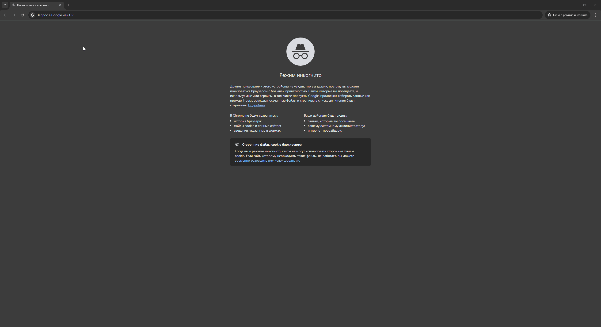
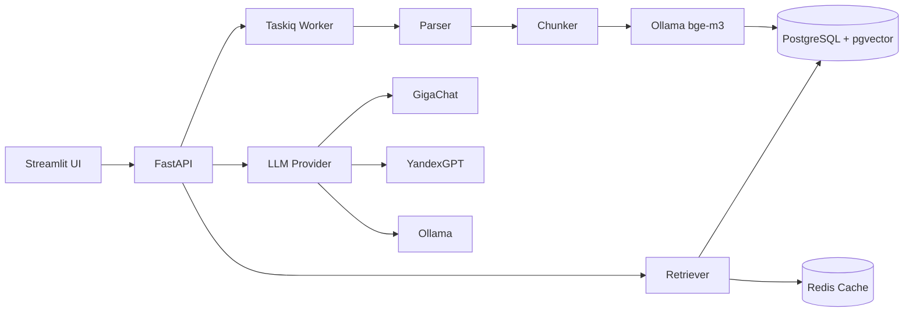

# AI Docs Chat

RAG-сервис для поиска и ответов по документам (PDF, DOCX, TXT). Загружаете документы — задаёте вопросы — получаете ответы с цитатами из источников.



## Быстрый старт

```bash
git clone https://github.com/makel0ve/ai-docs-chat.git
cd ai-docs-chat
cp .env.example .env
docker compose up -d
```

- UI: http://localhost:8501
- API: http://localhost:8000/docs

## Архитектура



## Технологии


## Возможности

- Загрузка документов PDF, DOCX, TXT с асинхронной индексацией
- Семантический поиск по документам через pgvector (cosine distance)
- Ответы на основе документов с указанием источников
- Стриминг ответов (SSE) для всех провайдеров
- Переключение между LLM-провайдерами: GigaChat, YandexGPT, Ollama
- Кэширование эмбеддингов и ответов в Redis
- История чатов с сохранением в БД
- Фоновая индексация через Taskiq

## Оценка качества

Сравнение провайдеров на eval-сете из 28 вопросов по 4 документам:

| Провайдер | Keyword match | Precision@5 | Latency | Negative passed |
|-----------|--------------|-------------|---------|-----------------|
| GigaChat  | 84.7%        | 76.0%       | 1.04s   | 100%            |
| YandexGPT | 86.0%        | 76.0%       | 1.05s   | 100%            |
| Ollama    | 73.3%        | 76.0%       | 20.97s  | 100%            |

## API

### Документы

- `POST /documents` — загрузка документов (множественная)
- `GET /documents` — список документов
- `GET /documents/{id}` — информация о документе
- `DELETE /documents/{id}` — удаление документа

### Чат

- `POST /chat` — вопрос по документам (SSE-стрим)

### Сессии

- `POST /sessions` — создание сессии
- `GET /sessions` — список сессий
- `GET /sessions/{id}/messages` — история сообщений
- `DELETE /sessions/{id}` — удаление сессии